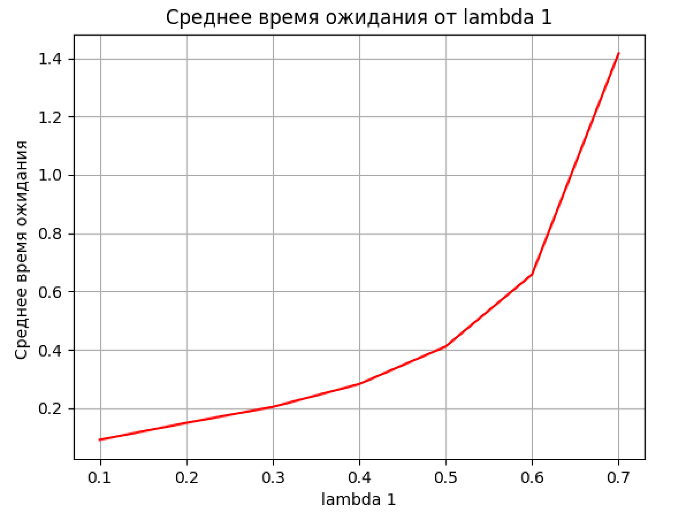
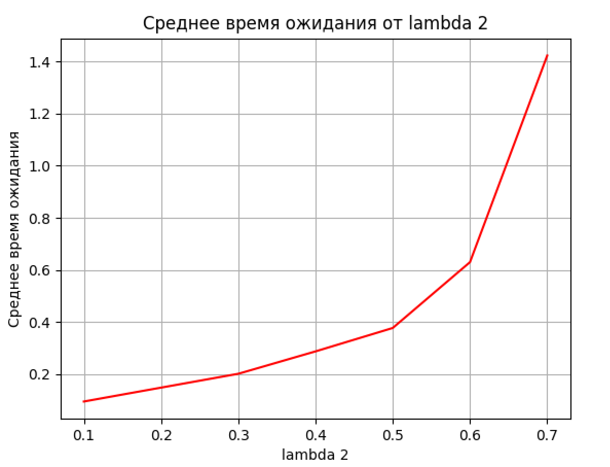
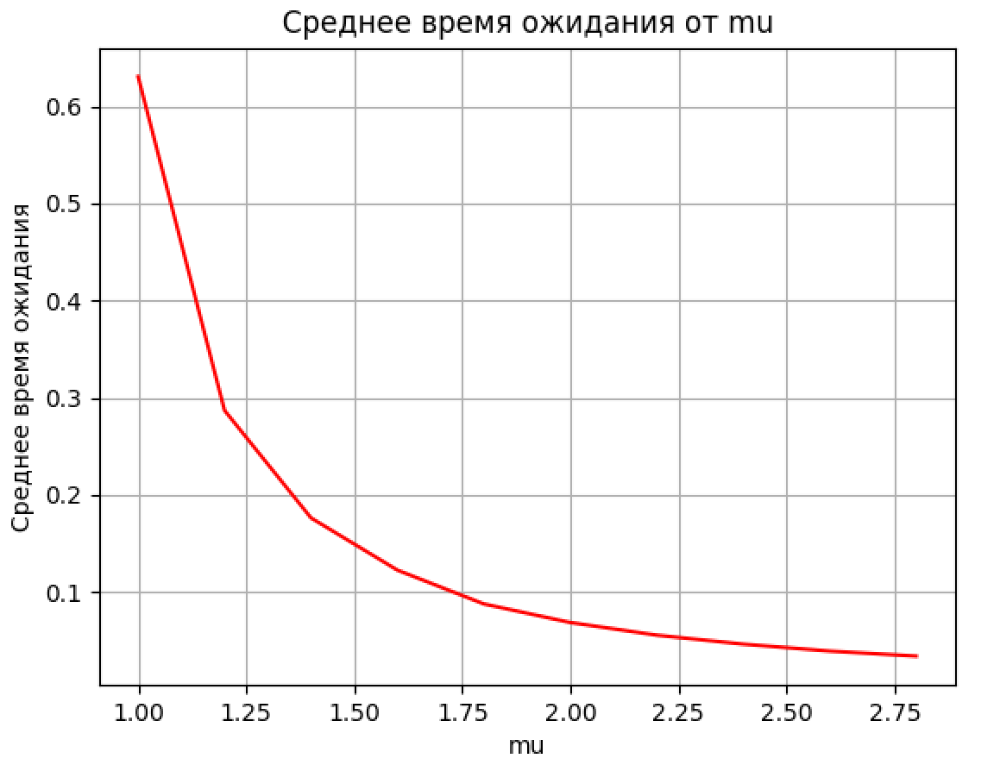
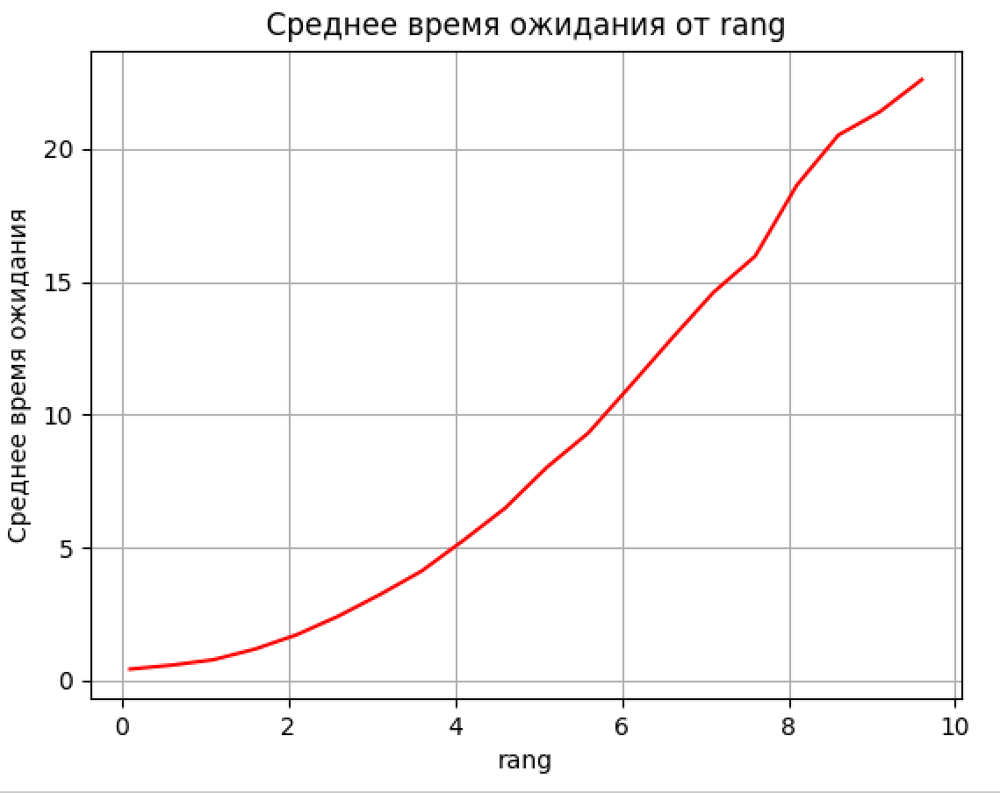

<!-- ### Параметры закона распределния Рэлея 
$$f(x) = \frac{x}{\sigma^2} e^{-x^2/(2\sigma^2)}, \quad x \geq 0$$
 $$\sigma = \frac{1}{\lambda \sqrt{2}}$$ -->

<!-- ### Параметры равномерного закона распределния

$$f(x) = \begin{cases} 
\frac{1}{b-a}, & a \leq x \leq b \\
0, & \text{иначе}
\end{cases}$$

$$ a = mean - rang $$
$$ b = mean + rang  $$ -->

